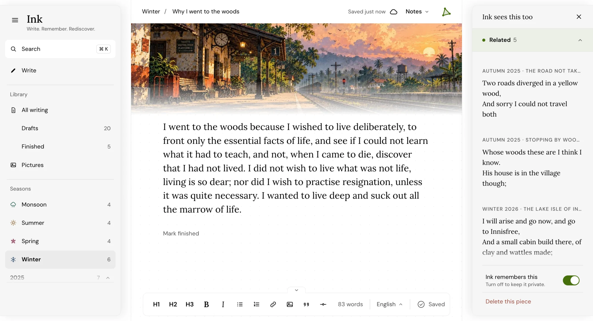
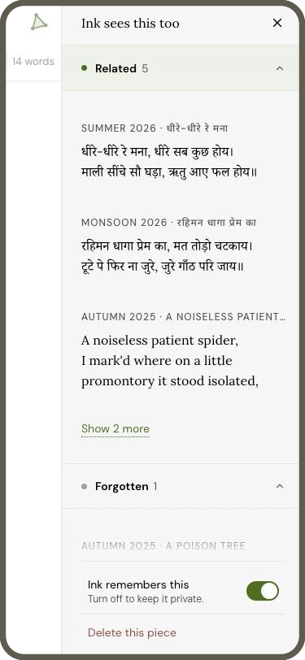
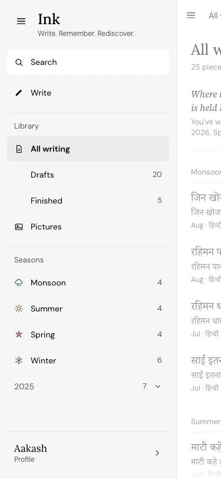

<h1 align="center">Ink</h1>

<p align="center"><strong>Everything you have written, within reach.</strong></p>

<p align="center">
  <a href="https://withink.app">Website</a> ·
  <a href="https://withink.app/#join">Join the waitlist</a> ·
  <a href="https://withink.app/privacy">Privacy</a>
</p>

<p align="center">
  
</p>

Ink is a private place to write that remembers. It shows you the old poem that echoes today's line, the piece you forgot you started, and the idea you keep returning to. It never touches your sentences. It only gives your own words back at the right moment.

<p align="center">
  
  &nbsp;
  
  &nbsp;
  
</p>

## Why Ink

Writing piles up in notes apps, drafts, chat threads and phone memos. A line arrives, you save it somewhere, and months later you cannot find it, or you forget you ever wrote it.

Ink keeps the writing in one place and does the remembering for you. You write. Ink reads what you have already written and quietly connects it.

## What you get

- **Old pieces that meet new ones.** Beside what you are writing, Ink shows older pieces close in meaning, pieces you have not opened in months, and loose lines that have no home yet.
- **Search that finds what you meant.** Cmd+K finds a piece by the words you remember, forgives typos, and also finds pieces about the same thing in different words.
- **A quiet remark now and then.** Under All writing, Ink notes when an old line returns or when you keep writing about the same thing. The sentences are fixed patterns, never generated.
- **A calm page.** Poems, stories, letters and notes, in any language, with a style, a season and an optional cover picture. It saves on your device first and syncs in the background.
- **Writing that stays yours.** Every request is scoped to you. Keep any piece out of Ink's memory, or delete it for good. Ink has no streaks, no dashboards, and no critique.

## How it works

1. **You write.** The page saves as you go.
2. **Ink remembers.** Once a piece has been quiet for a while, a private service turns it into a meaning vector with an open model ([BGE-M3](https://huggingface.co/BAAI/bge-m3)). Nothing runs on a keystroke.
3. **Ink connects.** Related writing and search compare vectors inside your own pieces and nobody else's. Only open models are used. The settings behind search are in [docs/search.md](./docs/search.md).

## Join the waitlist

Ink is opening to its first writers soon. Leave your address and Ink writes to you when hosted plans open.

**[Join the waitlist at withink.app](https://withink.app/#join)**

---

## For developers

## Repository layout

| Path | What it holds |
| --- | --- |
| `apps/web` | The writing app (React, Vite, TypeScript) |
| `apps/api` | The API (Fastify, Zod, PostgreSQL through Supabase), migrations, and the Bruno privacy checks |
| `apps/embedder` | The embedder service (Python), see its [README](./apps/embedder/README.md) |
| `packages/schemas` | Zod schemas shared by the web app and the API |
| `docs` | Setup notes: [search](./docs/search.md) and [sign-in emails](./docs/auth-setup.md) |

It is a pnpm and Turborepo monorepo.

## Run it locally

You need Node 20 or newer, pnpm, a [Supabase](https://supabase.com) project, and Python 3.11 for the embedder.

1. Install the packages.

   ```bash
   pnpm install
   ```

2. Copy `.env.example` to `.env` and fill it in (Supabase keys, the database URL, and the embedder address).

3. Start the embedder. The first start downloads the model, about 2 GB.

   ```bash
   cd apps/embedder
   python3.11 -m venv .venv && source .venv/bin/activate
   pip install --require-hashes -r requirements.txt
   python server.py
   ```

4. Start the API and the web app in two terminals.

   ```bash
   pnpm --filter @ink/api dev
   ```

   ```bash
   pnpm --filter @ink/web dev
   ```

   The web app opens at `http://localhost:5173`. In development the API serves interactive docs at `/docs`.

To open the app on a phone on the same network, run the web app with `--host` and open `http://<your-computer-address>:5173`. The address also needs to be in the Supabase redirect list (see [docs/auth-setup.md](./docs/auth-setup.md)).

## Checks

```bash
pnpm typecheck
pnpm test
```

Every pull request also runs a CI job that starts a local Supabase and the real API, then runs the Bruno collection in `apps/api/bruno`. It signs in as two different writers and checks that neither can read or change the other's data, and that expired, broken and signed-out tokens are refused.

## Status

Ink is in early development. It is not open to outside contributions (see [CONTRIBUTING.md](./CONTRIBUTING.md)); to report a security issue, do it privately instead of opening a public issue.

## Licence

MIT. See [LICENSE.md](./LICENSE.md).
